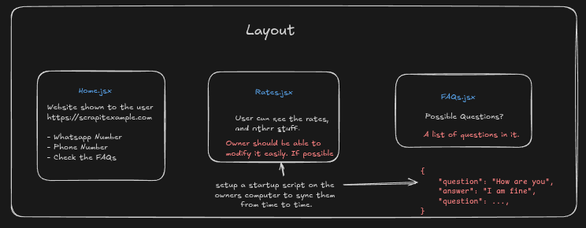
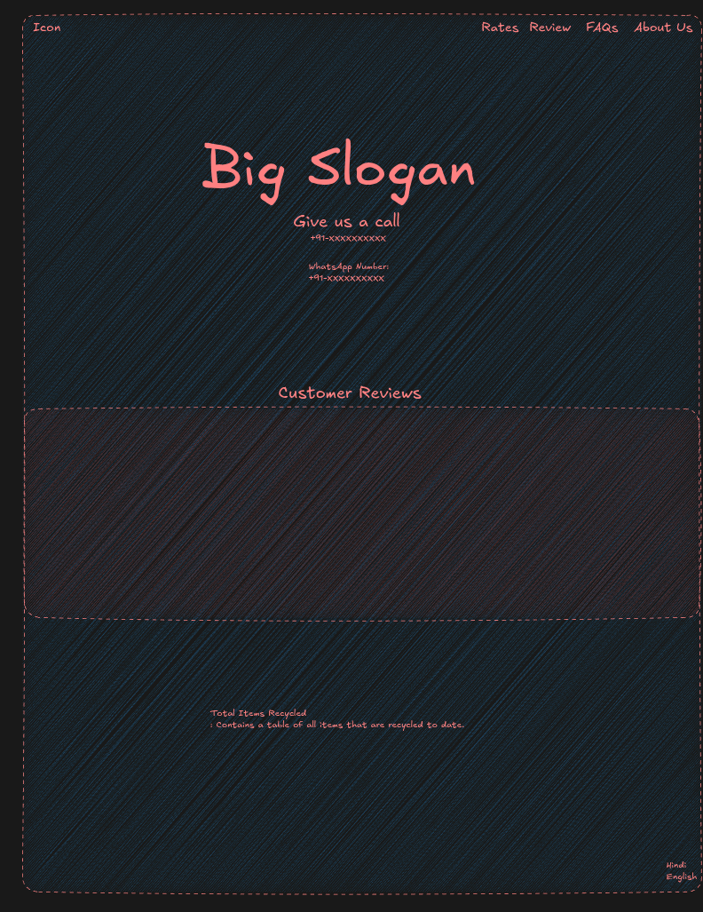
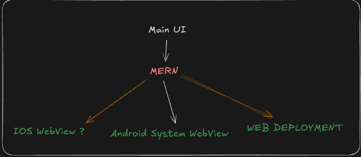

# Important
- Every important thing about architecture will be in the excalidraw file.
- Excalidraw can be seen with https://excalidraw.com or VSCode excalidraw extension.
- An example of pages and what they should contain.
 
- The way I think the client and server should interact with each other
 
- What the website might look like
 
- What our codebase might look like

